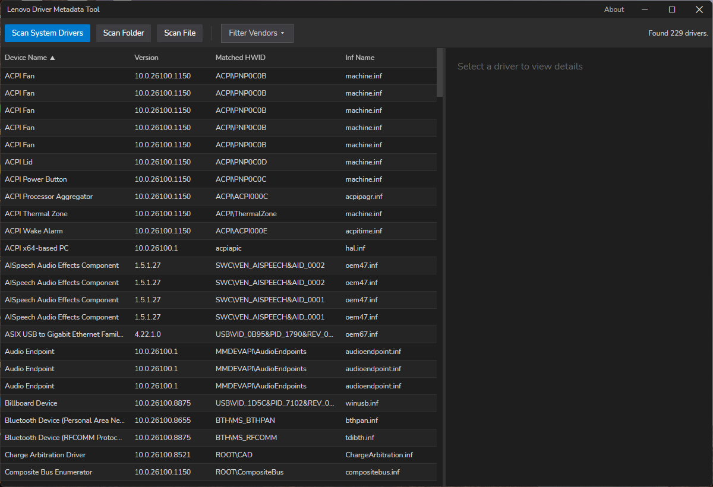
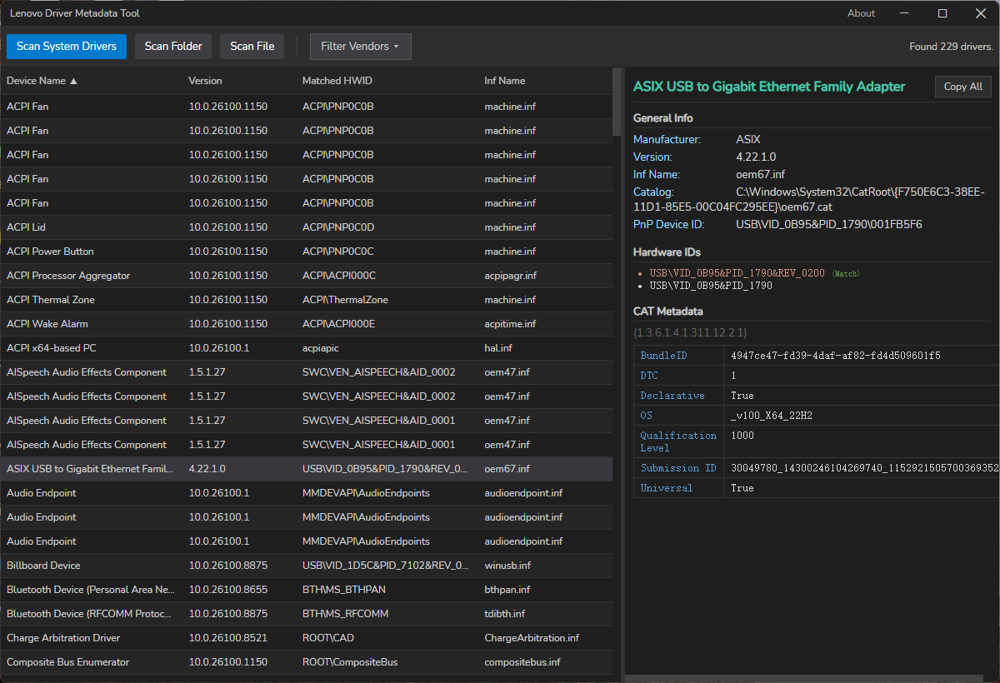
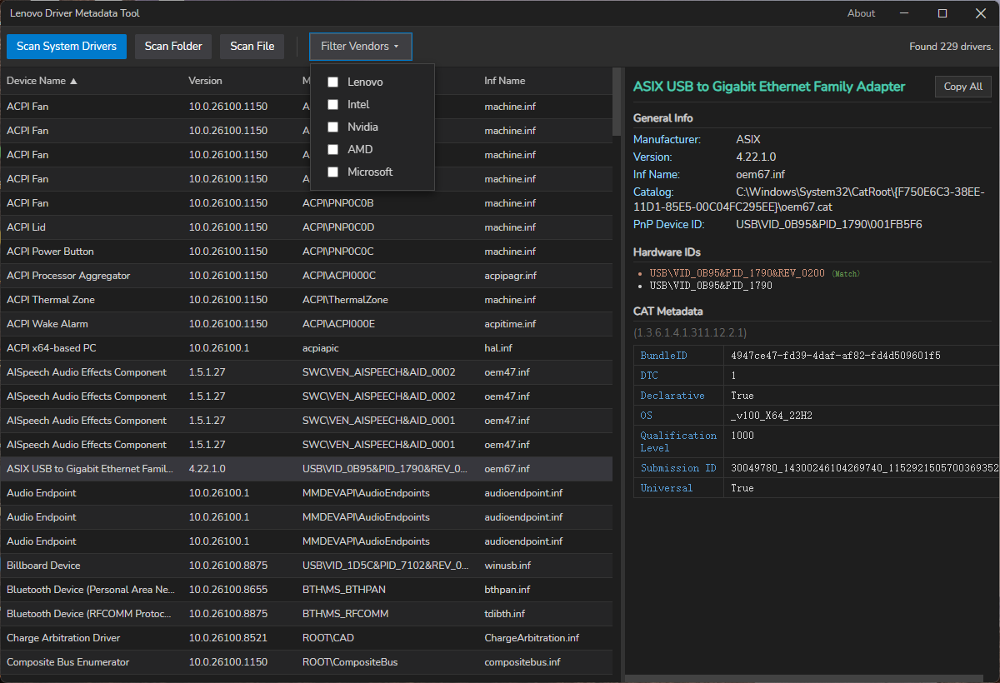
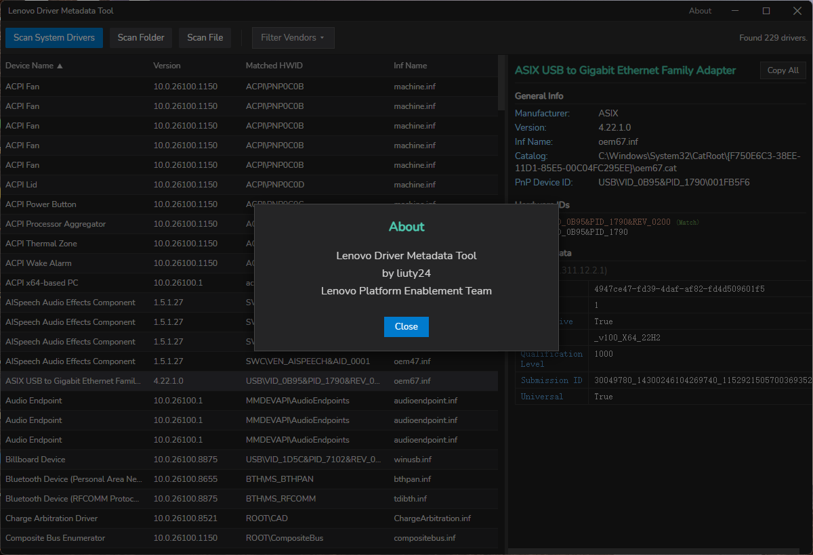

# DriverMetadata

DriverMetadata 用于批量读取 Windows 驱动目录文件（`.cat`）中记录的提交元数据，主要是 Submission ID 与 Bundle ID。

单个驱动的元数据可以通过以下步骤手工获取：在设备管理器中查出 INF 名，在 `CatRoot` 目录下定位同名 `.cat`，用证书查看器打开，在扩展项中找到厂商自定义 OID，再手工解码其中的字符串。该流程对单个驱动可行，对整机上百个驱动则不具备可操作性。

本工具将上述流程自动化：启动后自动扫描本机全部已签名驱动，左侧列出设备，右侧显示选中驱动的解析结果。



## 工作原理


四个阶段中，元数据解析是核心部分。`.cat` 文件本质上是一个 CTL（证书信任列表）。驱动提交系统在签名过程中，会将本次提交的元数据以扩展项形式写入 CTL，挂在 OID `1.3.6.1.4.1.311.12.2.1` 下。

工具通过 `crypt32!CryptQueryObject` 读取 CTL，遍历其扩展项，筛选出该 OID 的条目，再解析其中的 ASN.1 结构：

```text
SEQUENCE
 ├─ 0x1E  BMPString    → 键名，大端 UTF-16
 ├─ 0x02  INTEGER      → 跳过
 └─ 0x04  OCTET STRING → 值，小端 UTF-16
```

:::tip

键名以 `HWID` 开头的条目会被过滤掉。这些值与界面「Hardware IDs」区块的内容重复，保留会使元数据表冗长。

:::

## 运行环境

- Windows。依赖 WMI 与 `crypt32.dll`，不支持其他平台
- 无需管理员权限。读取 WMI 与 `CatRoot` 目录以普通用户权限即可完成

## 三种扫描方式

工具栏提供三个入口：

| 按钮 | 行为 | 适用场景 |
|------|------|---------|
| **Scan System Drivers** | 通过 WMI 枚举本机全部已签名驱动，逐个匹配 `.cat` 并解析 | 默认动作，启动时自动执行一次 |
| **Scan Folder** | 递归遍历指定目录下所有 `.cat`，仅执行解析 | 核对待发布驱动包 |
| **Scan File** | 解析单个 `.cat` | 确认单个文件 |

后两种方式不经过 WMI，因此没有设备名，列表中显示的是文件名。

:::info

System Scan 为非阻塞操作：其执行期间仍可点击 Scan Folder / Scan File，一旦触发，进行中的系统扫描结果将被丢弃。Folder / File 扫描期间三个按钮均禁用。

:::

## 详情面板

选中一行后，右侧分为三个区块。



**General Info** 来自 WMI。其中 `Catalog` 若为 `N/A`，表示按 INF 名换算出的 `.cat` 在 `CatRoot` 中不存在，此类驱动没有可读的元数据。

**Hardware IDs** 列出设备的全部硬件 ID，其中一条标记为 `(Match)`，表示工具判定的、签名驱动实际匹配到的 ID。判定分两步：

1. 以 WMI 上报的 `HardWareID` 为基准比对，依次尝试精确相等、前缀匹配、反向最长前缀匹配；均不命中则使用原值
2. 在此基础上选取更适合展示的形式：`ACPI\VEN_xxx&DEV_yyyy` 优先折叠为等价的 `ACPI\xxxyyyy`；否则优先选择不含 `&` 且不以 `*` 开头的条目

**CAT Metadata** 为从 `.cat` 解析出的键值表。其中 `BundleID` 与 `Submission ID` 使用频率最高，后者可用于在 Hardware Dev Center 上定位对应提交。

## 筛选与排序

厂商筛选提供五个固定预设：Lenovo、Intel、Nvidia、AMD、Microsoft。勾选后对厂商字段做子串匹配（大小写不敏感），支持多选；全部不勾选表示不过滤。



四个表头均可点击排序，再次点击反向。版本列按数字段比较而非字符串比较，因此 `10.0.26100.8875` 会正确排在 `10.0.26100.1150` 之后。

列表获得焦点后可使用 ↑ ↓ 在驱动间移动。

## 批量导出

按住 Ctrl 或 Shift 多选时，右侧切换为汇总视图，每个设备仅显示版本、Bundle ID / Submission ID 与前三条硬件 ID。

点击 **Copy All** 将选中内容复制为纯文本，格式如下：

```text
[DEVICE] ASIX USB to Gigabit Ethernet Family Adapter
 ├─ Version: 4.22.1.0 | Manufacturer: ASIX
 ├─ Inf Name: oem67.inf
 ├─ Catalog: C:\Windows\System32\CatRoot\{F750E6C3-38EE-11D1-85E5-00C04FC295EE}\oem67.cat
 ├─ PnP DeviceID: USB\VID_0B95&PID_1790\001FB5F6
 ├─ Matched HWID (DISPLAY): USB\VID_0B95&PID_1790&REV_0200
 ├─ HardwareID(s):
 │   ► USB\VID_0B95&PID_1790&REV_0200 [HIT ID]
 │   ► USB\VID_0B95&PID_1790
 └─ CAT Metadata:
    > BundleID               : 4947ce47-fd39-4daf-af82-fd4d509601f5
    > Submission ID          : 30049780_1430024610426974...
```

多个设备之间以一行 `=` 分隔。复制通过 Go 侧的剪贴板接口完成，不受 WebView 剪贴板权限限制。

## 关于



## 源码与构建

源码位于 toolkit 仓库的 `DriverMetadata-Go/`，技术栈为 Wails v2 + React + TypeScript。

```bash
cd DriverMetadata-Go
wails build -m
```

调试使用 `wails dev`，会额外提供 `http://localhost:34115` 调试入口，可在浏览器中直接调用 Go 侧绑定的方法。
