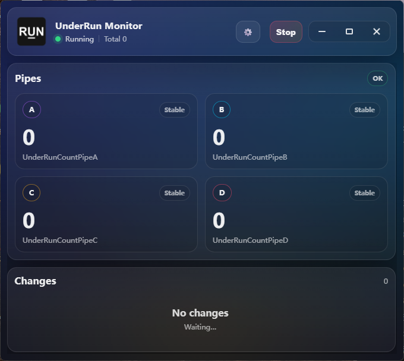
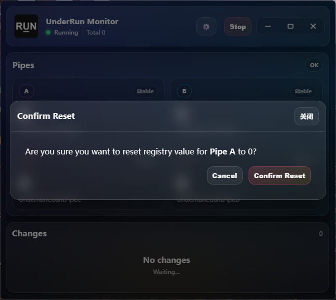
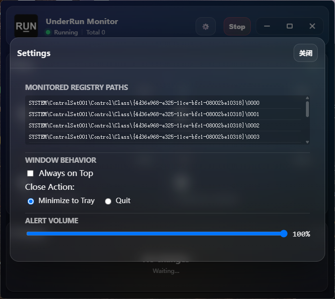

# UnderRun

UnderRun 用于持续监控显示管线的 underrun 计数，并在计数发生变化时发出告警。

Underrun 指显示管线未能及时将下一帧数据送至扫描输出而产生的欠载事件，表现为闪屏、撕裂或瞬时黑场。事件持续时间极短，难以在发生时捕捉，但显示驱动会将累计次数写入注册表。

该计数不提供任何变更通知机制，人工方式只能在 regedit 中反复刷新观察。本工具以固定周期轮询该计数，并在检测到变化时主动提示。



## 计数位置


相关值位于**显示适配器**设备类下：

```text
HKEY_LOCAL_MACHINE\SYSTEM\ControlSet001\Control\Class\
  {4d36e968-e325-11ce-bfc1-08002be10318}\00NN
```

`{4d36e968-...}` 为 Windows Display 设备类 GUID，`00NN` 为该类下的设备实例号。工具依次探测 `0000` 至 `0009`，以是否存在 `UnderRunCountPipeA` ~ `UnderRunCountPipeD` 四个值作为判定条件；命中后缓存该索引，后续每次轮询只打开这一个键。

界面上的 A / B / C / D 四张卡片分别对应这四个值。

:::warning

这四个值由**显示驱动**写入，与音频设备无关。名称中的 Pipe 指显示管线（如 Intel 集显的 pipe A/B/C/D），一条 pipe 通常对应一路输出。若机器上没有会上报该计数的显卡驱动，界面右上角显示 `NA`，四个数值恒为 0。

:::

读取时兼容两种值类型：优先按整型读取，失败则按二进制读取前四个字节，反转字节序后解析为 int32。

## 轮询与告警


轮询周期为 1 秒。以下几点决定了告警的实际触发条件：

**首次采样仅作为基线，不触发告警。** 监控启动后的第一次快照仅存入 `last`。执行 `Stop` 后再 `Start` 会重新取基线，因此手动清零或重启监控之后不会立即产生告警。

**判定条件是「不相等」而非「增大」。** 计数由 5 回落至 0（例如被其他工具清零）同样计为一次变化并触发告警。

**读取失败不触发告警。** 某次轮询无法打开键或读取值时，界面标记为 `NA`，但不产生 change 事件，以避免设备热插拔瞬间的误报。

检测到变化时执行三项动作：Go 侧调用 `WindowUnminimise` 与 `WindowShow` 将窗口恢复并置前；前端弹出 `UnderRun Occured` 模态框，列出每条 pipe 的 `prev → curr`；同时循环播放 `alert.wav`。铃声在关闭模态框后停止。

右侧 Changes 面板保留最近 80 条变化记录，每条包含时间戳与差值。

## 计数清零

双击任意 Pipe 卡片会弹出确认框。



确认后写入 4 字节全 0 的 `REG_BINARY`。执行顺序为：停止监控 → 写入 → 重新启动监控（同时重新取基线）。

写入 HKLM 需要管理员权限。工具先尝试直接写入，失败后通过 PowerShell 提权调用 `reg.exe`：

```powershell
Start-Process -FilePath "reg.exe" `
  -ArgumentList 'add "HKLM\..." /v UnderRunCountPipeA /t REG_BINARY /d 00000000 /f' `
  -Verb RunAs -Wait -WindowStyle Hidden
```

因此清零操作会触发一次 UAC 提示，而监控本身不需要任何特权。

## 设置项



| 项目 | 说明 |
|------|------|
| **Monitored Registry Paths** | 只读，列出十个候选实例路径，用于确认监控范围 |
| **Always on Top** | 窗口置顶，适用于全屏测试场景 |
| **Close Action** | `Minimize to Tray`（默认）关闭时收入托盘并继续监控；`Quit` 则退出进程 |
| **Alert Volume** | 告警铃声音量，默认 100% |

:::caution

以上设置仅在当前运行期内有效，不做持久化。每次启动均恢复为 Minimize to Tray、不置顶、音量 100%。

:::

## 托盘与单实例

在 Close Action 为默认值时，关闭窗口后程序收入托盘并继续运行。托盘图标双击可恢复窗口，右键菜单提供 `Show` 与 `Quit`。

程序通过名为 `UnderRunMonitorMutex` 的命名互斥量保证单实例：重复启动时将已有窗口置前，新进程随即退出。

## 运行环境

- Windows，需要读取 `HKLM` 下的注册表
- 监控无需管理员权限，仅清零操作需要
- 告警声音需要窗口先获得一次用户交互（点击或按键）才能播放，这是浏览器内核的自动播放策略限制，Wails 应用同样适用

## 源码与构建

源码位于 toolkit 仓库的 `UnderRun-Go/`，技术栈为 Wails v2 + React + TypeScript，无边框窗口，最小尺寸 520×400。

```bash
cd UnderRun-Go
wails build -m
```
