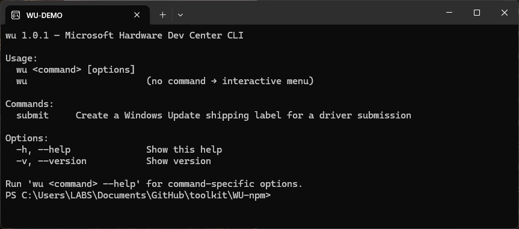
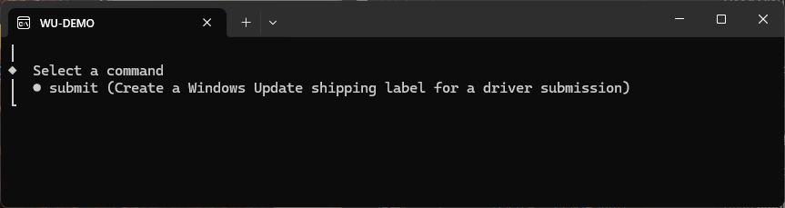
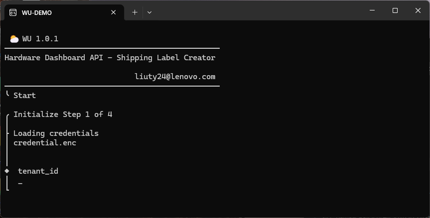
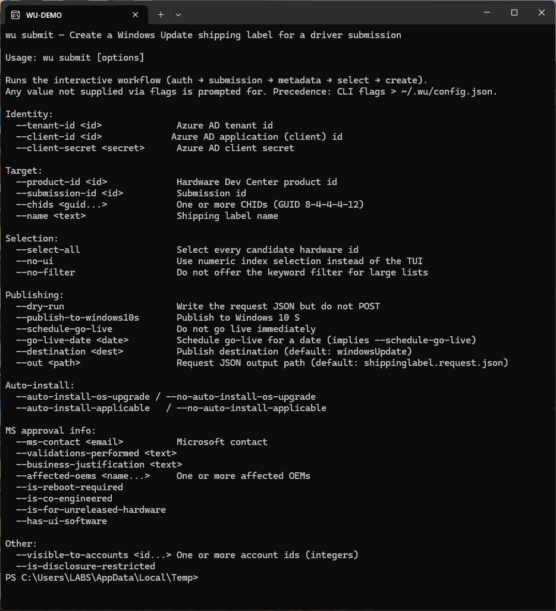

# WU

`wu` 是一个命令行工具，用于通过 Microsoft Hardware Dev Center API 为驱动提交创建 Windows Update Shipping Label。

在 Hardware Dev Center 网页上完成一次发布标签创建，需要依次进入产品与提交页、展开硬件 ID 列表逐条勾选、填写 CHID 以及一组业务字段。其中业务字段在多数情况下取值固定，硬件 ID 选择则每次都需重新进行。

本工具将固定部分下沉至配置文件，将选择部分实现为终端内的多选列表。



## 安装

```bash
npm install -g @platformtools/wu
```

或不安装直接执行：

```bash
npx @platformtools/wu
```

要求 Node.js 18 及以上。

## 命令结构

`wu` 按子命令组织。不带参数运行时打开交互菜单：



| 命令 | 说明 |
|------|------|
| `submit` | 为一次驱动提交创建 Windows Update 发布标签 |

全局选项为 `-h, --help` 与 `-v, --version`。子命令自身的参数通过 `wu <命令> --help` 查看。

:::info

在管道或 CI 等不具备交互终端的环境中不带命令运行时，工具不会抛出 TTY 相关错误，而是打印帮助并以退出码 `2` 结束。

:::

## 凭据存储


首次运行 `wu submit` 时依次请求 `tenant_id`、`client_id`、`client_secret`、`ms_contact`。



四项值经 AES-256-GCM 加密后写入 `~/.wu/credential.enc`。加密密钥不落盘，每次由 scrypt 从「主机名 + 用户名 + 平台」构成的机器指纹派生，salt 随机生成并以明文存于同一文件。

由此，该文件在其他机器上无法解密。解密失败时代码将其视为「无凭据」，重新发起提问，不产生错误。

:::caution

已存储的 `tenantId` / `clientId` / `clientSecret` 优先级**高于**命令行同名参数，即 `--tenant-id` 无法覆盖已存储的值。更换凭据需删除 `~/.wu/credential.enc` 后重新运行。

`--ms-contact` 是例外，该参数会覆盖并更新存储值。

:::

## 业务默认值

取值固定的字段存于 `~/.wu/config.json`，首次运行时自动生成：

| 键 | 默认值 |
|----|--------|
| `validationsPerformed` | `Product assurance team full range tested` |
| `businessJustification` | `to meet MDA requirements` |
| `affectedOems` | `["N/A"]` |
| `destination` | `windowsUpdate` |
| `goLiveImmediate` | `true` |
| `autoInstallDuringOSUpgrade` | `true` |
| `autoInstallOnApplicableSystems` | `true` |
| `publishToWindows10s` | `false` |
| `isDisclosureRestricted` | `false` |
| `isRebootRequired` | `false` |
| `isCoEngineered` | `false` |
| `isForUnreleasedHardware` | `false` |
| `hasUiSoftware` | `false` |
| `visibleToAccounts` | `[]` |

优先级为**命令行参数 > 配置文件**，不支持环境变量覆盖。修改默认值直接编辑该 JSON；文件损坏或字段缺失时回落到内置默认值。

## submit 的四个阶段


### Step 1 — Initialize

读取凭据，对缺失项发起提问，随后向 `login.microsoftonline.com` 获取 access token。

### Step 2 — Submission Selection

需要 `productId` 与 `submissionId`。此处支持一种简化输入：在 productId 提示处直接粘贴 Partner Center 的提交链接，工具会从中解析出两个 ID，并跳过第二个提示。

### Step 3 — Metadata & Selection

从 submission 响应中定位 `driverMetadata` 的下载地址，下载后展开。原始结构为四层嵌套：

```text
BundleInfoMap
  └─ InfInfoMap
       └─ OSPnPInfoMap
            └─ PnpId → { Manufacturer, DeviceDescription }
```

每个 `(bundle, inf, os, pnp)` 组合计为一个候选，摊平后按 bundle → inf → OS → PNP 排序。每个 bundle 分配一个 `B1` / `B2` / `B3` 形式的标签与一种颜色，用于在多选列表中区分候选来源。

候选数超过 300 时，会先询问是否按关键字过滤，关键字同时匹配 INF 名、OS 代号、PNP ID、厂商与设备描述。

### Step 4 — Create Shipping Label

补充标签名与 CHID，构造请求体并先写入文件，默认路径为当前目录下的 `shippinglabel.request.json`。创建成功后输出对应的 Partner Center 链接。

## 常用参数

完整列表见 `wu submit --help`：



常见组合：

```bash
# 完整走一遍交互流程，但不提交，仅生成请求体
wu submit --dry-run

# 全选候选、指定 CHID、发布到 Windows 10 S，适用于脚本化调用
wu submit --select-all --chids 12345678-1234-1234-1234-123456789abc --publish-to-windows10s

# 以编号输入替代 TUI 多选
wu submit --no-ui

# 已知 product / submission 时跳过前两个阶段的提问
wu submit --product-id 1234567890 --submission-id 9876543210
```

:::tip

`--dry-run` 会完整执行认证、拉取与选择流程，仅省略最后的 POST，适用于首次使用或验证参数组合生成的请求体。

:::

## 退出码

| 码 | 含义 |
|----|------|
| `0` | 成功，含 `--dry-run` 正常结束 |
| `1` | 运行时错误：元数据无候选、未选择任何目标、API 返回错误 |
| `2` | 参数问题：必填项为空，或非交互环境下未提供命令 |
| `130` | 用户取消（Ctrl+C）或超时 |

## 注意事项

**整个流程有 180 秒超时限制。** 计时自 `submit` 启动开始，在交互提示处停留过久同样会被中断并返回 `130`。

**CHID 为必填项，且必须为标准 GUID 格式**（8-4-4-4-12）。交互模式下格式错误会当场退回重新输入，不会在后续步骤失败。

**候选为空时流程终止。** 元数据解析结果为空通常意味着 submission 结构不符合预期（缺少 `BundleInfoMap`），需要回到提交本身排查。

## 源码与构建

源码位于 toolkit 仓库的 `WU-npm/`，技术栈为 TypeScript + tsup，TUI 基于 `@clack/prompts` 与 `picocolors`。该项目是早期 Go 版本 `WU-Go` 的重写。

```bash
cd WU-npm
npm install
npm run build      # 产物位于 dist/
npx vitest run     # 运行测试
```
